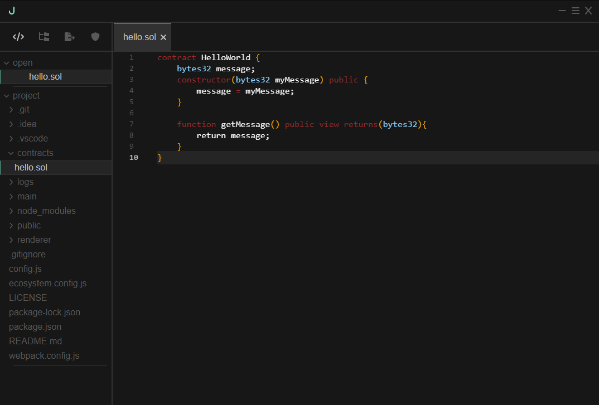
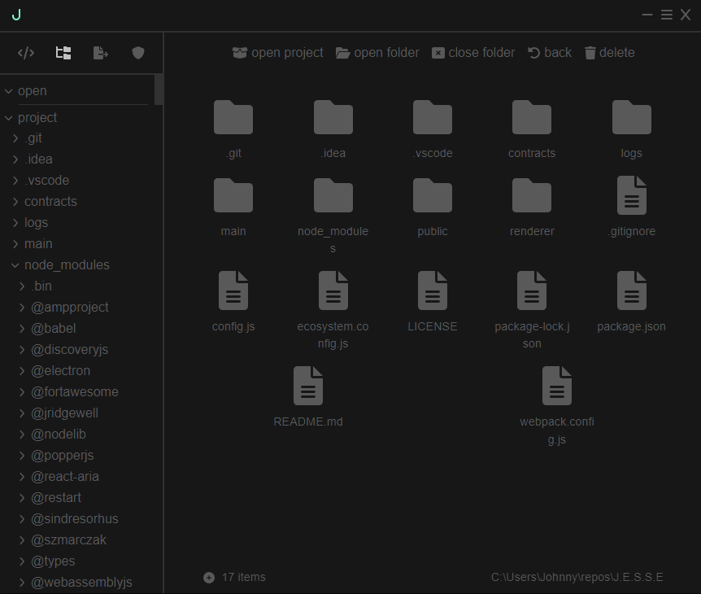
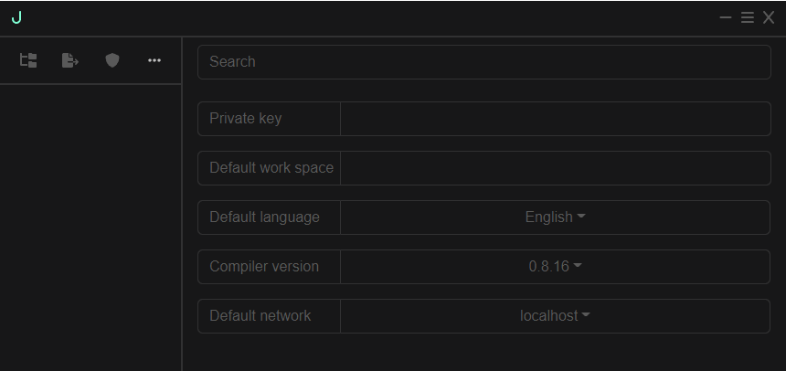

# J.E.S.S.E.
Experimental project. Implementation of the code-editor on a web technology stack.


## Prerequisites

#### Install all modules 
``` bash
    npm install
```

#### Dev mode
``` bash
    npm run dev
```

#### Production mode

- Set NODE_ENV into production mode
```
    NODE_ENV=production
```
- npm run make, but (npm install --save-dev @electron-forge/cli)

## Config
``` js
{
    window : {
        minWAside : 100,            // <number>, aside panel width
        minWPages : 200,            // <number>, page panel width
        renderingChunkSize : 50000, // <number>, number of characters to render in one render-cycle
    },
    path_history_size : 10,         // <number>, fs history size
    mode : MODE,                    // <string>, software mode
    port : 1234                     // webpack server port (for dev mode)
}
```

## Preview

- code-editor (mvp)
<div style="text-align:center"></div>

- basic file system
<div style="text-align:center"></div>

- settings (template)
<div style="text-align:center"></div>